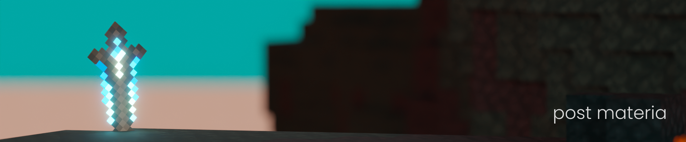
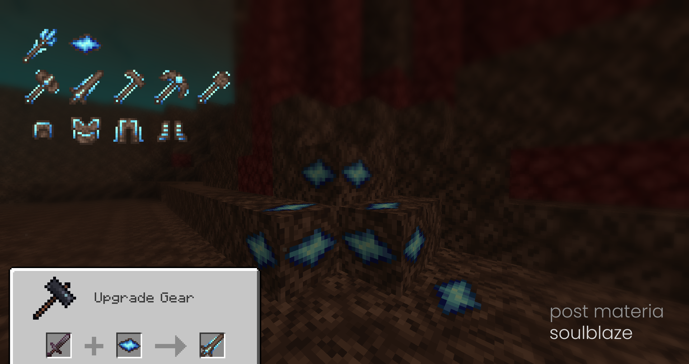
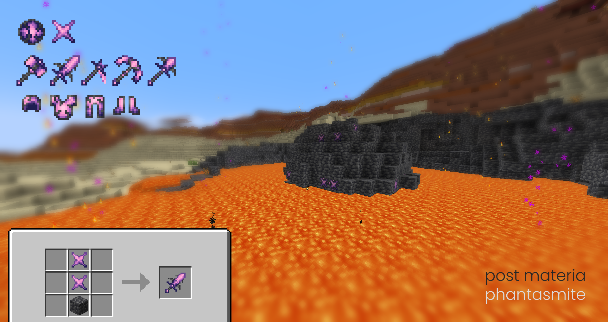

Post Materia is a Minecraft mod which introduces several new thematic post-Netherite resources to the game.

---

Soulblaze Ore can be found in the Soulsand Valley after the Wither is defeated, and requires Netherite to mine.
Soulblaze equipment is focused on high damage.

Phantasmite Ore can be found in rare meteors scattered across the Overworld (>=15,000 blocks from spawn), but will require Netherite to mine.
Phantasmite equipment is focused on healing utilities.

---

Each tool set also has a unique and powerful item to assist you in your adventures. 

### License

MIT

### Bundled Libraries

- FibLib (MIT)

- WorldData (MIT)

